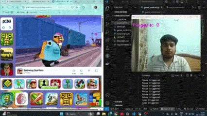

# ✋🎮 Hand Gesture Game Controller

Control your favorite games using just **hand gestures** captured through your webcam!  
This project uses **OpenCV**, **MediaPipe**, and **PyAutoGUI** to detect hand movements and simulate key presses in real-time.

---

## 📸 Demo Gestures

| Fingers Shown | Action Triggered | Keyboard Key Pressed |
|:--------------|:-----------------|:---------------------|
| 1 Finger       | Jump             | ↑ (Up Arrow)          |
| 2 Fingers      | Move Right       | → (Right Arrow)       |
| 3 Fingers      | Move Left        | ← (Left Arrow)        |
| 4 Fingers      | Slide Down       | ↓ (Down Arrow)        |
| 5 Fingers      | Pause / Resume   | Spacebar              |

> 🕹️ Best used with simple games like **Chrome Dino** (`chrome://dino/`) or endless runners!

---

## 🛠️ Built With

- **Python 3.7+**
- **OpenCV** (for webcam and image processing)
- **MediaPipe** (for hand tracking and landmark detection)
- **PyAutoGUI** (for keyboard simulation)

---

## 📥 Installation Guide

1. **Clone this repository**:
   ```bash
   git clone https://github.com/your-username/hand-gesture-game-controller.git
   cd hand-gesture-game-controller

2. **Install the dependencies**:

  ```bash
  pip install opencv-python mediapipe pyautogui

3. **Run the main file**:

  ```bash
  python game_control.py

4.  **Allow camera access and start playing!**


## 📂 Project Files

hand-gesture-game-controller/
├── hand_track.py       
**Hand tracking and finger counting module**
├── game_control.py     
**Main script to detect gestures and simulate keypress**
└── README.md           
**Project documentation**

## 🚀 How It Works

Captures real-time webcam feed using OpenCV.

Detects hand and finger positions using MediaPipe.

Counts the number of raised fingers.

Maps each finger count to a different keyboard key press.

Simulates the key press using PyAutoGUI.

Displays the number of fingers detected in the video feed.


## 🎯 Future Upgrades (Can be done if needed)
🎙️ Add Voice Command support (say "Jump", "Slide" etc.).

🖐️ Recognize custom hand gestures (like thumbs up, fist, etc.).

📲 Build a mobile remote control version.

🧩 Develop a GUI dashboard to configure gesture actions.

## 👨‍💻 Author
Made with ❤️ by Archit Kumar.
Feel free to fork, improve, and submit pull requests!


## 📜 License
This project is licensed under the MIT.
